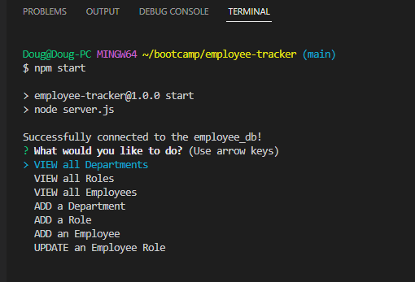

# Employee Tracker CLI Application
[](https://choosealicense.com/licenses/mit/)
## Description
Developers frequently have to create interfaces that allow non-developers to easily view and interact with information stored in databases. These interfaces are called content management systems (CMS). This application uses Node.js, Inquirer, and MySQL to allow users to access an employee database, view departments, roles, and employees; add a department, role, or employee; as well as update current employee information.


## Table of Contents
- [Employee Tracker CLI Application](#employee-tracker-cli-application)
  - [Description](#description)
  - [Table of Contents](#table-of-contents)
  - [Languages \& Technologies Used](#languages--technologies-used)
  - [Installation](#installation)
  - [Usage](#usage)
  - [Walkthrough Video Link](#walkthrough-video-link)
  - [Questions](#questions)
  - [License](#license)


## Languages & Technologies Used


## Installation
First clone this repository to your local machine.

Now, install all required dependencies by using the following command:

```
npm install
```

Next, navigate to the 'db' folder and login to MySQL. Then, use the following commands to create and populate the employee database:


```
SOURCE schema.sql
```

and

```
SOURCE seeds.sql
```

Finally to start the application, return to the root folder and use the command:

```
npm start
```


## Usage
Follow the inquirer prompts to navigate the databse, view, departments, roles, employees, add departments, roles, employees, or update employee information.





## Walkthrough Video Link
https://drive.google.com/file/d/1iEY7nPvhLu7YniLZuTjcIvkvune8M8Xo/view


## Questions
Check out my work at [github/dsoda86](https://github.com/dsoda86).


Please send your questions to  [dsoda86@gmail.com](mailto:dsoda86@gmail.com?subject=[GitHub]%20Dev%20Connect).
## License
[](https://choosealicense.com/licenses/mit/)


Click to learn more about this license and other commonly used licenses.